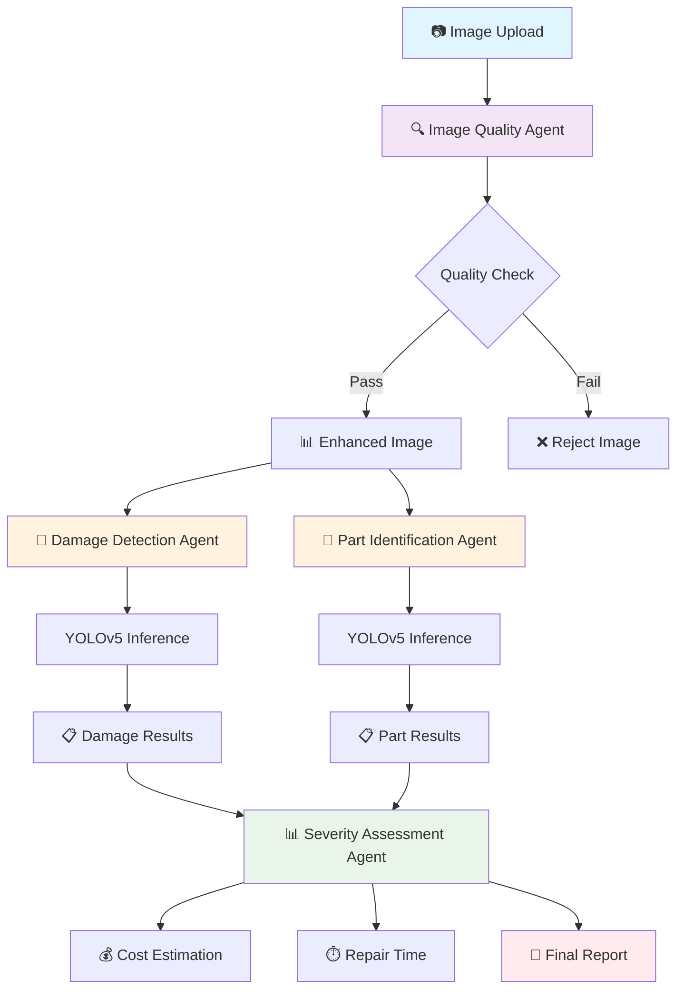
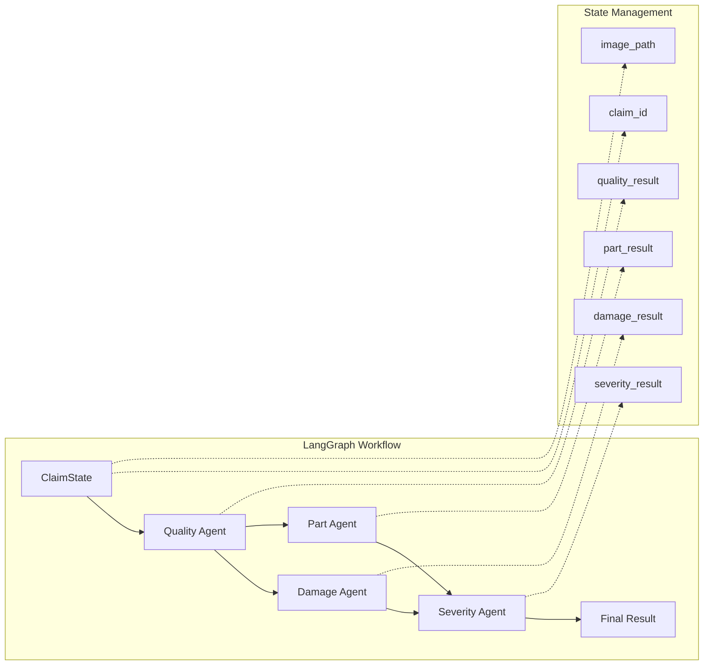

# 🚗 Vehicle Damage Detection System

An AI-powered multi-agent system for automated vehicle damage assessment using computer vision and workflow orchestration.

## 🏗️ System Architecture



## 🔄 Processing Workflow

### Phase 1: Image Quality Assessment
```
📷 Input Image → 🔍 Quality Check → 🎨 Enhancement → ✅ Validation
```

**Quality Checks:**
- Blur detection (Laplacian variance)
- Brightness analysis (HSV values)
- Resolution validation
- Manipulation detection

### Phase 2: Parallel Analysis
```
🎨 Enhanced Image
    ├── 🔧 Damage Detection (YOLOv5)
    └── 🚗 Part Identification (YOLOv5)
```

**Damage Detection:**
- Identifies damage types and locations
- Calculates damage area percentages
- Returns bounding boxes with confidence scores

**Part Identification:**
- Detects vehicle parts in the image
- Maps part locations and types
- Provides confidence metrics

### Phase 3: Severity Assessment
```
📋 Damage Data + 📋 Part Data → 📊 Scoring Algorithm → 💰 Cost/Time Estimation
```

**Severity Calculation:**
```
Score = (Number of Parts × 2) + (Damage Area ÷ 10)

Severity Levels:
├── Minor: Score < 1 ($100-500, 1 day)
├── Moderate: Score < 2 ($500-1500, 3 days)
├── Major: Score < 3 ($1500-5000, 7 days)
└── Severe: Score ≥ 3 ($5000-15000, 14 days)
```

## 🧠 Agent Architecture



## 🎯 Key Components

| Component | Technology | Purpose |
|-----------|------------|---------|
| **Workflow Engine** | LangGraph | Orchestrates agent pipeline |
| **Computer Vision** | YOLOv5 + PyTorch | Object detection and classification |
| **Image Processing** | OpenCV | Quality assessment and enhancement |
| **Web Interface** | Streamlit | User-friendly frontend |
| **State Management** | TypedDict | Data flow between agents |

## 📊 Output Examples

### Damage Report Structure
```json
{
  "overall_severity": "moderate",
  "severity_score": 1.8,
  "estimated_cost_range": [500, 1500],
  "repair_time_days": 3,
  "damage_detections": [
    {
      "damage_type": "scratch",
      "confidence": 0.89,
      "bbox": [150, 200, 300, 350]
    }
  ],
  "identified_parts": [
    {
      "part_name": "front_bumper",
      "confidence": 0.95,
      "bbox": [100, 180, 400, 380]
    }
  ]
}
```

## 🚀 Quick Start

1. **Install Dependencies**
   ```bash
   pip install -r requirements.txt
   ```

2. **Run Streamlit Interface**
   ```bash
   streamlit run streamlit_app.py
   ```

3. **Upload Vehicle Images**
   - Single or batch processing
   - Real-time status updates
   - Annotated results with damage visualization

## 🔧 Configuration

- **Model Path**: `C:/Misogi/Vehicle-Damage-Detection/best.pt`
- **Confidence Threshold**: 0.25
- **Image Enhancement**: Automatic histogram equalization + sharpening
- **Quality Threshold**: 0.6

---
*Automated vehicle damage assessment for insurance and automotive industries*
